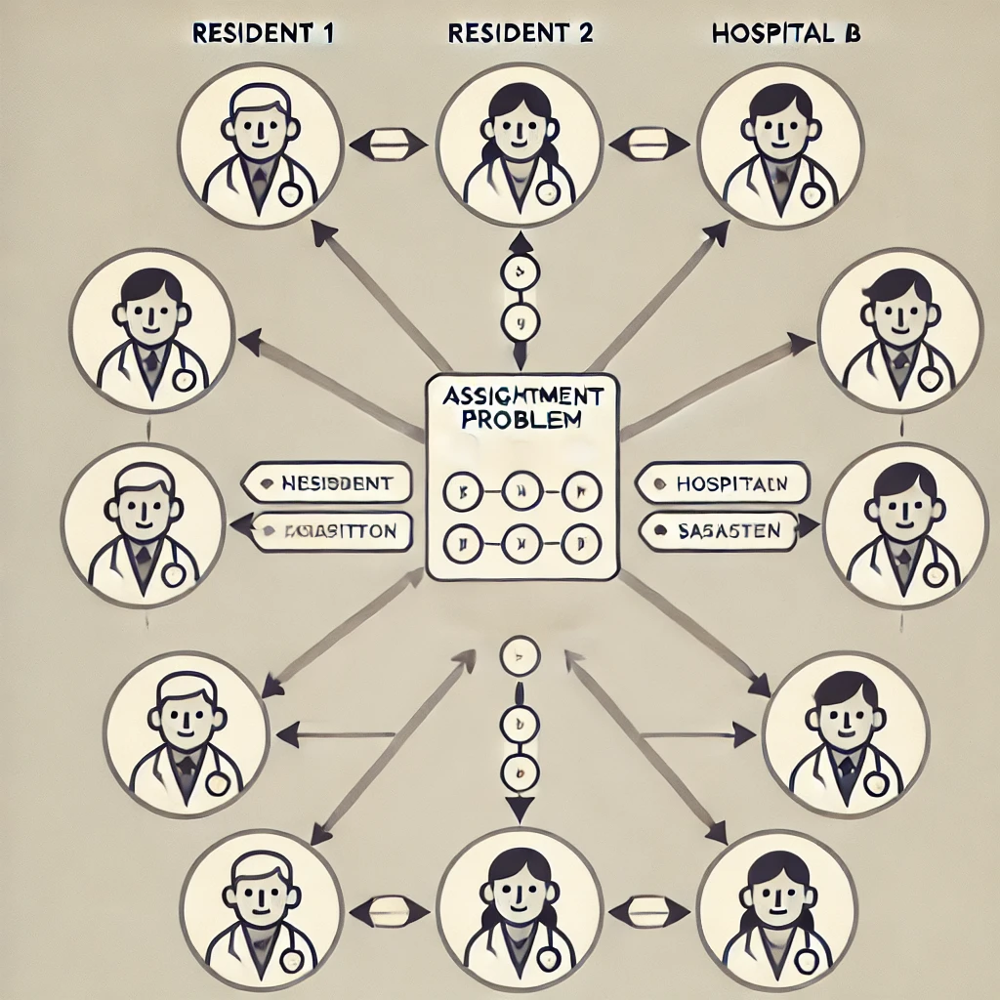
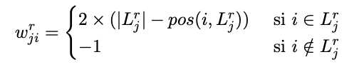
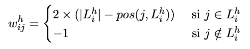

# ResidencyMatchOptimizer

A Linear Programming Approach to Optimize Medical Residency Placement



# Overview

ResidencyMatchOptimizer is a tool that leverages linear programming to optimize medical residency placement. It uses an optimization model that considers both residency program preferences and applicant rankings to determine the most efficient match. This tool can enhance the satisfaction of residency programs and applicants by ensuring an optimal placement.

# Problem Background

In recent discussions, government agencies have been exploring the feasibility of a nationwide, optimized residency placement system for medical graduates. Currently, placements are determined based on a classic merit-based ranking: residency candidates are ordered by their scores across various metrics and then select hospitals in order of ranking. However, there is a push to modernize this system by incorporating not only the candidates’ preferences but also the priorities of the residency programs (i.e., hospitals).

The objective is to base this new approach on the well-known National Resident Matching Program (NRMP), which has been widely adopted and appreciated for balancing the needs of applicants and programs. However, the modified system seeks to define a new way to evaluate solution quality, with particular emphasis on satisfaction metrics that factor in both resident and hospital preferences.

# ResidencyMatchOptimizer Project

In this initial proof-of-concept phase, several technology companies are invited to propose solutions that add high value to this matching problem. Solutions demonstrating strong optimization in terms of overall satisfaction will gain a competitive edge if the project moves forward. DM Analytics, our consulting firm, is participating with an innovative, linear programming-based approach called ResidencyMatchOptimizer. This tool aims to find an optimal match between residents and hospitals by maximizing a comprehensive satisfaction metric across all participants.

The problem in detail involves assigning `n` residents to `m` hospitals. Here’s the simplified approach for this proof of concept:

- Each hospital has a set number of available positions (assuming \( n = m \times p \), where each hospital has `p` positions).
- Prior interviews have helped both residents and hospitals create ordered preference lists:
- Each hospital \( i \) (1 ≤ i ≤ m) has a preference list, \( L_{hi} \), ranking residents from most to least desirable.
- Similarly, each resident \( j \) (1 ≤ j ≤ n) has a list, \( L_{rj} \), ranking hospitals by personal preference.

For each assignment, we define individual satisfaction indices:

- **Resident Satisfaction** (\( w_{jri} \)): For resident \( j \) assigned to hospital \( i \), calculated based on the resident’s position of hospital \( i \) in their preference list. For example, if a resident has ranked hospital \( i \) at position \( \text{pos}(i, L_{rj}) \), their satisfaction score is defined as:
  


- **Hospital Satisfaction** (\( w_{hij} \)): For hospital \( i \) receiving resident \( j \), based on the hospital’s ranking of resident \( j \). If resident \( j \) is ranked at \( \text{pos}(j, L_{hi}) \), then:
  


Each assignment maximizes total satisfaction by summing the satisfaction scores across all residents and hospitals, resulting in a globally optimized solution.


## Features

- **Linear Programming-based Matching**: Employs linear programming (LP) to solve the residency matching problem.
- **Optimal Matching**: Provides an optimal match output based on the objective functions and constraints defined in the model.


## Model Formulation

This section describes the linear programming formulation used to optimize the assignment of residents to hospitals, aiming to maximize overall satisfaction.

### Definitions

- A set of `n` residents, with `o_j` representing the availability (supply) of each resident `j`.
- A set of `m` hospitals, with `d_i` representing the demand of each hospital `i`.
- `c_ij` denotes the overall satisfaction score from assigning resident `j` to hospital `i`.

### Assumptions

1. Each resident-hospital pair is a feasible assignment, forming a fully connected bipartite graph.
2. There are no infeasible assignment combinations.
3. The demand for residents by hospitals matches the supply of residents in each instance, meaning that the system is balanced:
   
   

   Where:
   - \( o_j \): Availability (supply) of resident `j`, which is considered equal to 1 for all cases.
   - \( d_i \): Demand of hospital `i`, which varies according to the instance size (`small`, `medium`, or `large`).

### Decision Variables

- \( X_{ij} \): Binary variable where \( X_{ij} = 1 \) if resident `j` is assigned to hospital `i`, and 0 otherwise.

### Objective Function

Among all feasible solutions, the goal is to find the assignment that maximizes the overall satisfaction of both residents and hospitals:


### Feasibility Constraints

1. **Residents**: Each resident `j` must be assigned to exactly one hospital `i`:

   

2. **Hospitals**: Each hospital `i` must receive a number of residents equal to its demand \( d_i \):

   

3. **Non-negativity**: The decision variable \( X_{ij} \) must be non-negative:

   

### Linear Programming Formulation

The linear programming model can be expressed as follows:


Subject to:


This formulation ensures that each resident is assigned to exactly one hospital, each hospital's demand is met, and overall satisfaction is maximized.

## Installation

1. Clone this repository:

    ```bash
    git clone https://github.com/SantiagoRomanoOddonde/ResidencyMatchOptimizer.git
    cd ResidencyMatchOptimizer
    ```

Dependencies include:
- `cplex` - for modeling and solving the linear programming problem.
- `NumPy` - for numerical operations.

## Usage

1. Run the main script :

    ```bash
    python python resident_assignment.py
    ```

2. Check the output, which will include:
    - The optimal match between applicants and residency programs.
    - Metrics on preference alignment, showing the satisfaction levels for both parties.

    Example output:

        ```--------------RESULTADOS CONSOLIDADOS--------------------------
            lp_results_global:  [9878.0, 9888.0, 9942.0, 9855.0, 9906.0, 9849.0, 9846.0, 9915.0, 9960.0, 9841.0]
            lp_count_pref_res:  [477, 478, 477, 474, 475, 481, 479, 482, 478, 475]
            lp_count_pref_hos:  [87, 90, 79, 81, 83, 78, 87, 79, 94, 80]
            lp_count_pref_global:  [64, 68, 56, 55, 58, 59, 66, 61, 72, 55]
            count_res_not_desired_lp_global:  [413, 410, 421, 419, 417, 422, 413, 421, 406, 420]
            desired_position_hos_for_res_lp_global:  [2.03, 2.07, 1.86, 1.97, 1.95, 1.96, 1.91, 1.82, 2.02, 1.96]
            ----------------------------------------
            greedy_results_global [9590.0, 9595.0, 9607.0, 9518.0, 9595.0, 9476.0, 9495.0, 9644.0, 9717.0, 9556.0]
            greedy_count_pref_res:  [473, 474, 472, 474, 466, 472, 464, 473, 466, 470]
            greedy_count_pref_hos:  [93, 87, 79, 78, 85, 78, 93, 81, 101, 82]
            greedy_count_pref_global:  [73, 69, 58, 58, 60, 59, 67, 61, 72, 58]
            count_res_not_desired_greedy_global:  [407, 413, 421, 422, 415, 422, 407, 419, 399, 418]
            desired_position_hos_for_res_greedy_global: [2.36, 2.27, 2.15, 2.19, 2.27, 2.31, 2.38, 2.13, 2.39, 2.27]
            ----------------------------------------
            gap_results:  [0.03, 0.0305, 0.0349, 0.0354, 0.0324, 0.0394, 0.037, 0.0281, 0.025, 0.0298]
            gap_mean:  3.225 %
        ```


If you want to see the problem in detail, you can check the `enunciado.pdf` file.